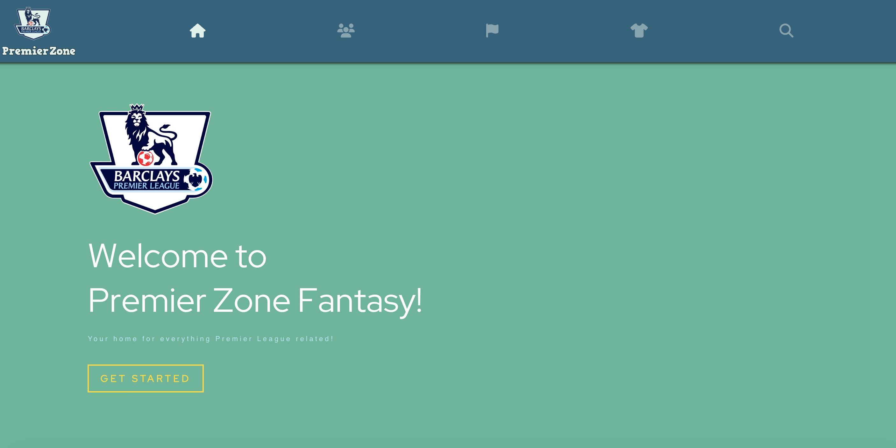

# PremierZone – Premier League Fantasy Web App

**PremierZone** is a comprehensive full-stack project designed to scrape match statistics for over 700 players, dynamically present the data, and predict match outcomes using machine learning. The app is organized into four modules: Backend, Frontend, Data Scraping, and ML Prediction.

> ⚠️ This is a prototype for academic submission. A fully original, customized version will be released soon.

## 🔧 Features

- **Data Scraping**: Collected match data for 700+ players using Python and `pandas`.
- **Backend**: Built with Spring Boot to serve dynamic REST APIs.
- **Database**: Managed with PostgreSQL and raw SQL queries.
- **Frontend**: Developed using React.js for a responsive UI.
- **Machine Learning**: Integrated predictive model using `scikit-learn`.

## 🚧 Status

🛠 In development. Final custom version launching soon.

